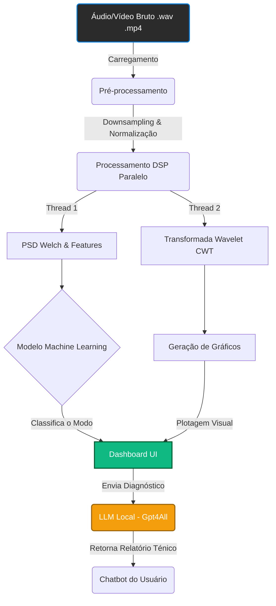

# SAMS ArcFlow Analytics

**Desenvolvido por:** DEXTER GPSERS - Soluções Inteligentes & Davi Freitas

---

## 📖 Sobre o Projeto
O **SAMS ArcFlow Analytics** visa criar uma representação virtual fidedigna dos processos de soldagem industrial. Este repositório hospeda o núcleo de software corporativo voltado ao monitoramento acústico, extração de métricas de engenharia e classificação automática de modos de transferência (Curto-Circuito, Spray, etc.) utilizando DSP (Processamento Digital de Sinais) e IA Generativa em Nuvem/Local.

Este projeto é desenvolvido em parceria técnica com o Grupo de Pesquisa **SOLDAMAT**, vinculado ao **INTM** (Instituto Nacional de Tecnologia em União e Revestimento de Materiais) da **UFPE** (Universidade Federal de Pernambuco), que forneceu a infraestrutura laboratorial, o embasamento teórico da engenharia de soldagem e os dados reais de captura acústica cruciais para o treinamento dos nossos algoritmos.

---

## 🧠 Treinamento do Modelo Local de IA

O diferencial analítico do SAMS ArcFlow baseia-se na aplicação combinada de Processamento Digital de Sinais (DSP) tradicional e **Machine Learning Clássico (Random Forest)** para inferência em tempo real.

O treinamento do nosso modelo classificador foi feito com base em vastos ensaios físicos:
1. **Aquisição:** O INTM realizou ensaios reais com microfones de smartphones captando o som do arco elétrico nos diferentes modos (Curto-Circuito, Globular, Spray, etc).
2. **Extração de Features:** Os sinais de áudio brutos foram convertidos em tabelas de características matemáticas utilizando *Wavelet Transforms (CWT)* e *Power Spectral Density (Welch)*. Foram extraídas métricas como Energia Média, Variância, Taxa de Cruzamento por Zero e Frequência de Pico.
3. **Treinamento e Validação:** Utilizando `scikit-learn`, um modelo de **Floresta Aleatória (Random Forest)** foi treinado no nosso *dataset*. O modelo otimizado foi então exportado (`.pkl`) e embarcado na aplicação, permitindo que o sistema processe arquivos locais de forma totalmente offline, instantânea e altamente precisa.

---

## ⚙️ Arquitetura e Funcionamento do Sistema

O fluxo do SAMS ArcFlow Analytics funciona como uma esteira de dados inteligente, que transforma som bruto em *Insights* de Engenharia interpretados em linguagem natural.



### Principais Funcionalidades

1. **Dashboard Analytics & UI Moderna**
   - Construído com `CustomTkinter` para fornecer um design system refinado (Dark Mode).
   - Telas modulares, tabelas de controle persistentes e navegação fluida em abas de trabalho.
   - Exibição de gráficos complexos renderizados via `Matplotlib` e integrados nativamente na interface Tkinter.

2. **Player de Mídia Integrado**
   - Reprodução de Vídeos Industriais (`moviepy` e renderização de frames em tempo real via PIL).
   - Controle OSD, botões de retrocesso/avanço (skip) rápidos, linha do tempo sincronizada e controle de velocidade.
   - Gerenciamento inteligente de saída de áudio (`pygame.mixer`) com *fallback* automático caso seja rodado em servidores e Máquinas Virtuais sem placas de som.

3. **IA Generativa Offline Especializada**
   - Integração com o motor `gpt4all` para interpretação e relatórios automatizados dos diagnósticos dos gráficos via um LLM local conversacional.
   - O chatbot de engenharia possui prompts embutidos para focar estritamente em soldagem.

4. **Armazenamento e Tratamento de Exceções Global**
   - Arquitetura robusta de interceptação de erros de multi-thread, registrando tudo em logs diários rotacionados de forma segura na pasta raiz.
   - Ferramenta de **Fast-Load (Cache em HD)** via serialização nativa do `joblib` para reabertura ultrarrápida de ensaios analíticos massivos.

---

## 📂 Estrutura do Repositório

```text
SAMS_ArcFlow_Analytics/
│
├── prototypes/           # Scripts de Estudo e Validação Legados (Octave)
│
└── src/                  # Aplicação Principal 
    └── com/gpsers/sams/  # Diretório Base da Aplicação Python
        ├── assets/       # Imagens de Fundo, Ícones e Mídia.
        ├── core/         # Worker Threads, Callbacks ML, Processador DSP.
        ├── data/         # Banco de Cache (.pkl) e Metadados.
        ├── ui/           # Arquitetura Visual CustomTkinter (Painéis e Janelas).
        ├── utils/        # Global Logger e Gerenciamento de Configuração (.env).
        └── main.py       # Ponto de Injeção e Execução.
```

---

*Este é um projeto de **Trabalho de Conclusão de Curso (TCC)** para o curso de **Tecnologia em Análise e Desenvolvimento de Sistemas** no **IFPE - Campus Recife**.*

---

## 👥 Desenvolvedores e Participantes

- **Davi Campelo de Freitas¹**
- **Meuse Nogueira De Oliveira Junior²**
- **Tiago Felipe de Abreu Santos³**

*¹ Discente de graduação em Análise e Desenvolvimento de Sistemas - IFPE.*  
*² Professor Doutor em Ciência da Computação - IFPE. Orientador do projeto.*  
*³ Professor Doutor em Engenharia Mecânica - UFPE. Coorientador do projeto.*  

---

## 🤝 Agradecimentos Oficiais

Agradecemos ao **Conselho Nacional de Desenvolvimento Científico e Tecnológico (CNPq)** pela cessão de bolsa e apoio financeiro.

Expressamos sinceros agradecimentos ao **Grupo de Pesquisa e Sistemas Embutidos e Rede de Sensores (GPSERS)** e ao **Laboratório D.E.X.T.E.R.** do **IFPE**, bem como ao **Grupo de Pesquisa SOLDAMAT** e ao **Instituto Nacional de Tecnologia em União e Revestimento de Materiais (INTM)** na **UFPE**, em particular à **Drª Ivanilda Ramos de Melo**, pelas indispensáveis infraestruturas laboratoriais concedidas.

---

<p align="center">
  
  &nbsp;&nbsp;&nbsp;&nbsp;&nbsp;&nbsp;&nbsp;&nbsp;
  
  &nbsp;&nbsp;&nbsp;&nbsp;&nbsp;&nbsp;&nbsp;&nbsp;
  
  &nbsp;&nbsp;&nbsp;&nbsp;&nbsp;&nbsp;&nbsp;&nbsp;
  
  &nbsp;&nbsp;&nbsp;&nbsp;&nbsp;&nbsp;&nbsp;&nbsp;
  
</p>

---

© **2026 Davi Freitas & Equipe DEXTER GPSERS.** Todos os direitos reservados.
